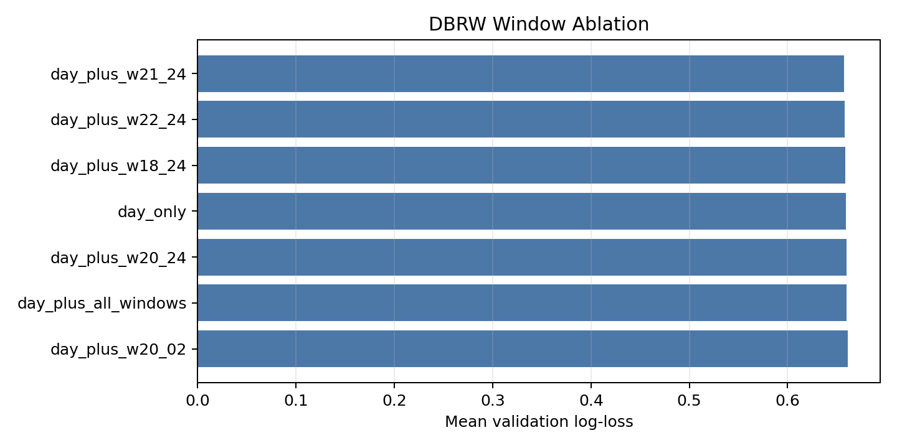
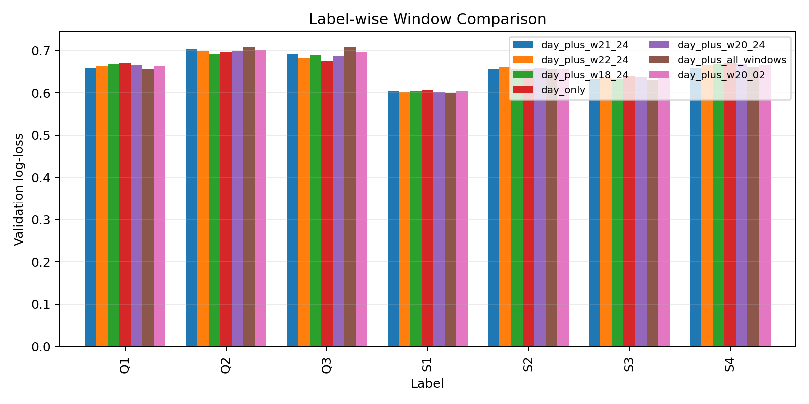
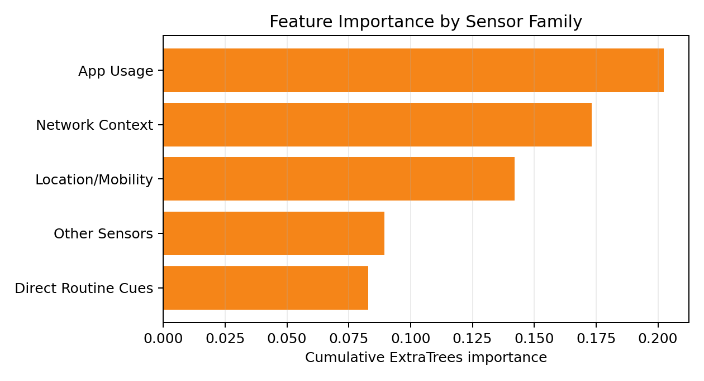

# DBRW Sleep and Stress Prediction

Code package for **Modeling Personalized Digital Bedtime Routines for Sleep and
Stress Prediction Using Multimodal Lifelogs**, prepared from the DACON / ETRI
Human Understanding AI Paper Challenge work.

This project studies whether the hours just before sleep contain useful
behavioral signals for next-day sleep and stress prediction. Smartphone and
wearable lifelogs were converted into multimodal tabular features, including
screen status, charging state, app use, GPS, Wi-Fi, BLE, light, movement, and
wearable signals. The main research idea is the **Digital Bedtime Routine
Window (DBRW)**: rather than treating one cue such as screen-off time as a
universal rule, the model uses the surrounding digital and physical context of
each subject's evening routine.

The submitted paper's central experiment compares daily features with several
bedtime routine windows. The best validation window in the preserved run was
`day_plus_w21_24`, with mean log-loss `0.6575`, compared with `0.6590` for
`day_only`. This supports the paper's claim that the 21:00-24:00 pre-sleep
transition adds modest but measurable information beyond full-day summaries.



## Repository Layout

| Path | What it contains |
| --- | --- |
| `src/dbrw_extratrees_pipeline.py` | Consolidated one-file pipeline for validation, submission generation, feature importance, and README figures. |
| `original_sources/` | Original scripts copied with their original filenames so their role and result history remain traceable. |
| `results/` | Small preserved result tables used in the paper narrative. No raw competition data are included. |
| `remade/` | Lightweight visualizations regenerated from the preserved result tables for quick review. |
| `paper_assets/` | Paper figures and LaTeX draft assets found in the local project. |
| `ORIGINAL_SOURCE_MAP.md` | Mapping from original files to the consolidated pipeline. |

Some scripts under `original_sources/` intentionally preserve old absolute
local paths from the working computer. They are kept for traceability. Use
`src/dbrw_extratrees_pipeline.py` for portable reruns.

## Research Question

The project asks:

> Can a personalized digital bedtime routine window improve sleep and
> fatigue/stress prediction compared with full-day lifelog summaries alone?

The modeling approach keeps the classifier fixed and changes the feature
window, so the validation table can be interpreted as a controlled window
ablation. The strongest preserved result is the `21:00-24:00` window, which is
used as the paper-aligned DBRW setting.

## Project Flow

1. Convert raw DACON/ETRI lifelog tables into subject-day feature tables.
2. Build day-only and bedtime-window feature sets.
3. Split each subject chronologically: earlier days for training, later days for
   validation.
4. Train one calibrated ExtraTrees classifier per target label.
5. Compare average log-loss across time windows.
6. Generate submission candidates and small paper-support result tables.
7. Produce lightweight visualizations for quick review.

## Main Reproduction Script

Install dependencies:

```powershell
pip install -r requirements.txt
```

Prepare competition-derived feature files locally:

```text
data/
  feature_table_train.csv
  feature_table_test.csv
  ch2026_submission_sample.csv
```

This private repository now also includes the raw competition files under
`data/raw/` and the label/sample files under `data/meta/`. The consolidated
script expects already-built feature tables. To rebuild those feature tables
from raw data, start from `original_sources/make_features.py`, then the
sleep-window extension scripts. Some original scripts still contain old local
paths, so update their path constants before rerunning them.

Run the DBRW window ablation:

```powershell
python src/dbrw_extratrees_pipeline.py validate-windows --data-dir data --output-dir outputs
```

Create submission candidates:

```powershell
python src/dbrw_extratrees_pipeline.py make-submission --data-dir data --output-dir outputs --window-results outputs/window_feature_validation_results.csv
```

Compute feature importances:

```powershell
python src/dbrw_extratrees_pipeline.py feature-importance --data-dir data --output-dir outputs --window-results outputs/window_feature_validation_results.csv
```

Regenerate README figures from saved small results:

```powershell
python src/dbrw_extratrees_pipeline.py make-readme-figures --results-dir results --output-dir remade
```

## Preserved Result Summary

The saved validation summary is in `results/window_feature_validation_summary.md`.

| Feature set | Mean log-loss |
| --- | ---: |
| `day_plus_w21_24` | 0.6575 |
| `day_plus_w22_24` | 0.6580 |
| `day_plus_w18_24` | 0.6588 |
| `day_only` | 0.6590 |
| `day_plus_w20_24` | 0.6598 |
| `day_plus_all_windows` | 0.6599 |
| `day_plus_w20_02` | 0.6611 |



Interpretation:

- `day_plus_w21_24` had the best average log-loss among the preserved window
  ablation runs.
- The gain over `day_only` is small, so the result should be described as a
  modest validation improvement, not a large performance jump.
- Wider windows such as `20:00-02:00` performed worse, suggesting that adding
  after-midnight context can introduce heterogeneous behavior rather than a
  cleaner bedtime-routine signal.

## Model

The paper-aligned model is a separate binary classifier for each label:

- `ExtraTreesClassifier`
- `n_estimators=500`
- `max_depth=4`
- `min_samples_leaf=4`
- `max_features="sqrt"`
- `class_weight="balanced"`
- median imputation inside the pipeline
- probability shrinkage: `p' = alpha * p + (1 - alpha) * prior`

The shrinkage coefficient is selected from `0.5, 0.55, ..., 1.0` using only an
inner chronological calibration split from the training rows.

## Labels

The seven prediction targets are:

| Group | Labels |
| --- | --- |
| Questionnaire | `Q1`, `Q2`, `Q3` |
| Sleep indices | `S1`, `S2`, `S3`, `S4` |



The feature-importance summary suggests that DBRW performance is not driven by
only direct bedtime cues. Location/mobility, Wi-Fi/BLE context, app usage, and
light/screen/charging indicators all contribute to the model's view of bedtime
behavior.

## Notes

- `personal_*` features are dropped by default in the consolidated pipeline to
  match the submitted paper's conservative interpretation.
- Use `--keep-personal` only for exploratory runs.
- The repository is meant for code review and reproducibility. It does not
  include raw lifelog data, heavy feature tables, or final competition submission
  files.
- The GitHub repository is private by default because it was prepared before
  competition-code upload and does not include redistributable raw data.
